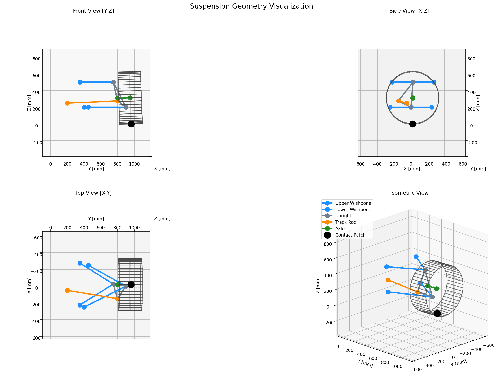
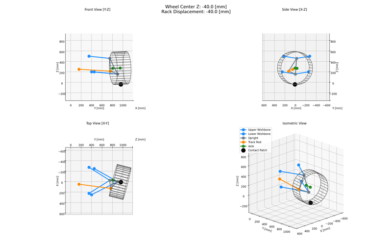

# suspension-kinematics

> ⚠️
>
> **Note that this system is both experimental and still under development. I do not recommend using it for anything important.**

`suspension-kinematics` is a Python-based geometric constraint solver for simulating the kinematic behaviour of vehicle suspension systems. It allows users to analyse suspension geometries by running parametric sweeps, then offering exports of solved system positions alongside visualisations of suspension state.

The tool is built around a numerical solver that determines the unique positions of all suspension components for a given set of boundary conditions (e.g., a specific wheel height or steering rack position).

<p align="center">
  
  <br>
  <em>Visualisation of a double wishbone suspension at its design condition.</em>
</p>

## Features

- Geometric Constraint Solver: Uses a numerical approach (Levenberg-Marquardt) with analytical Jacobians to solve for the kinematic state of the system based on geometric constraints.
- Parametric Sweeps: Simulate suspension motion by sweeping through a range of inputs, such as vertical wheel travel and steering rack displacement.
- Template-Based Suspension Models: Define suspension geometries using templates (currently double wishbone only) with simple YAML configuration files.
- Camber Shim Simulation: Model outboard camber shim configurations to simulate shimmed ball joint offsets.
- Derived Points System: A dependency-aware system for calculating the position of non-kinematic points (like wheel centers) based on the solved positions of core hard points.
- Suspension Metrics: Computes camber, caster, toe, kingpin inclination (KPI), scrub radius, mechanical trail, and side-view/front-view instant centres from the solved geometry.
- 2D Steering Linkages: Solve top-view two-segment steering systems driven by a central pitman arm, returning left/right roadwheel angle relationships.
- Data Export: Save simulation results in wide-format CSV or Apache Parquet files for further analysis.
- Visualization: Generate static plots of the design condition and create MP4/GIF animations of sweep motions.

## How it works

The core of the tool is a numerical solver that treats the suspension as a collection of rigid bodies connected by ideal spherical joints. The geometric relationships, such as the fixed length of a wishbone or a track rod, are defined as a system of nonlinear equations.

For each step in a simulation sweep, the solver's objective is to find the 3D coordinates for all free-moving points that will drive the residuals of these constraint equations to zero. Though really a root-finding problem, it is approached as nonlinear least squares problem using SciPy's `least_squares` implementation of the Levenberg-Marquardt algorithm.

This numerical approach is highly flexible, allowing the system to be "driven" by various targets (e.g., wheel center height, rack position), hard or derived, without needing to derive new analytical equations for each case.

## Installation

Use of a virtual environment is recommended. [uv](https://github.com/astral-sh/uv) is used in the examples below.

### Basic Installation

For core kinematics functionality without visualisation dependencies:

```bash
uv pip install suspension-kinematics
```

### Full Installation (with Visualization)

To generate plots and animations, you need to install the `[viz]` extra, which includes `matplotlib`.

```bash
uv pip install "suspension-kinematics[viz]"
```

## Usage

The primary way to use `suspension-kinematics` is through its command-line interface.

### 2D two-segment steering API

For steering-only studies, the `suspension_kinematics.steering` API solves a pure 2D
top-view linkage without requiring a full suspension model. Steering-only
coordinates use +X rearward, +Y rightward, and +Z upward. When importing 3D
hardpoints, `kingpin_lower` and `kingpin_upper` define the steering axis; the
2D kingpin point is the axis point at wheel-center height.

```python
import numpy as np

from suspension_kinematics.steering import (
    compare_two_segment_2d_and_3d,
    PitmanArmGeometry2D,
    PitmanArmHardpoints3D,
    SteeringCoordinateSystem,
    TwoSegmentSteeringHardpoints3D,
    TwoSegmentSteeringGeometry,
    WheelSteeringHardpoints3D,
    WheelSteeringGeometry2D,
    load_two_segment_steering_hardpoints_csv,
    solve_two_segment_from_left_wheel_angle,
    solve_two_segment_from_right_wheel_angle,
    solve_two_segment_steering,
    solve_two_segment_steering_3d,
    sweep_two_segment_steering,
)

print(SteeringCoordinateSystem.TOP_VIEW_X_LABEL)
print(SteeringCoordinateSystem.TOP_VIEW_Y_LABEL)

geometry = TwoSegmentSteeringGeometry(
    left_wheel=WheelSteeringGeometry2D(
        kingpin=np.array([0.0, -500.0]),
        wheel_center=np.array([60.0, -520.0]),
        tie_rod_pickup=np.array([-180.0, -420.0]),
    ),
    right_wheel=WheelSteeringGeometry2D(
        kingpin=np.array([0.0, 500.0]),
        wheel_center=np.array([60.0, 520.0]),
        tie_rod_pickup=np.array([-180.0, 420.0]),
    ),
    pitman=PitmanArmGeometry2D(
        pivot=np.array([-350.0, 0.0]),
        left_output=np.array([-350.0, -120.0]),
        right_output=np.array([-350.0, 120.0]),
    ),
)

solutions = sweep_two_segment_steering(geometry, [-8.0, 0.0, 8.0])
for state in solutions:
    print(state.pitman_angle_deg, state.left_wheel_angle_deg, state.right_wheel_angle_deg)

left_driven = solve_two_segment_from_left_wheel_angle(
    geometry,
    left_wheel_angle_deg=solutions[-1].left_wheel_angle_deg,
)
right_driven = solve_two_segment_from_right_wheel_angle(
    geometry,
    right_wheel_angle_deg=solutions[0].right_wheel_angle_deg,
)
print(left_driven.pitman_angle_deg, right_driven.pitman_angle_deg)

hardpoints_3d = TwoSegmentSteeringHardpoints3D(
    left_wheel=WheelSteeringHardpoints3D(
        kingpin_lower=np.array([0.0, -500.0, 280.0]),
        kingpin_upper=np.array([0.0, -500.0, 340.0]),
        wheel_center=np.array([60.0, -520.0, 320.0]),
        tie_rod_pickup=np.array([-180.0, -420.0, 280.0]),
    ),
    right_wheel=WheelSteeringHardpoints3D(
        kingpin_lower=np.array([0.0, 500.0, 280.0]),
        kingpin_upper=np.array([0.0, 500.0, 340.0]),
        wheel_center=np.array([60.0, 520.0, 319.0]),
        tie_rod_pickup=np.array([-180.0, 420.0, 281.0]),
    ),
    pitman=PitmanArmHardpoints3D(
        pivot=np.array([-350.0, 0.0, 300.0]),
        left_output=np.array([-350.0, -120.0, 285.0]),
        right_output=np.array([-350.0, 120.0, 286.0]),
    ),
)
geometry_from_3d = hardpoints_3d.to_2d_geometry()
state_from_3d = solve_two_segment_steering(hardpoints_3d, pitman_angle_deg=8.0)
state_3d = solve_two_segment_steering_3d(hardpoints_3d, pitman_angle_deg=8.0)
comparison = compare_two_segment_2d_and_3d(hardpoints_3d, pitman_angle_deg=8.0)
print(
    comparison.left_wheel_angle_delta_deg,
    comparison.right_wheel_angle_delta_deg,
)
```

`solve_two_segment_steering()` keeps the existing top-view 2D behaviour even
when fed 3D hardpoints. Use `solve_two_segment_steering_3d()` to preserve 3D
tie-rod lengths while rotating each wheel about its kingpin axis and rotating
the pitman outputs about global `+Z`. `compare_two_segment_2d_and_3d()` solves
both paths on the same hardpoints and reports wheel-angle and pickup-position
deltas so you can quantify projection error before wiring anything into the GUI.

For CSV input, use `category,name,x,y,z`. `symmetric` hardpoints are entered
only on the left side, so their Y value must be negative. `center` hardpoints
must lie on Y = 0.

```csv
category,name,x,y,z
symmetric,wheel_kingpin_lower,0,-500,280
symmetric,wheel_kingpin_upper,0,-500,340
symmetric,wheel_center,60,-520,320
symmetric,wheel_tie_rod_pickup,-180,-420,280
symmetric,pitman_output,-350,-120,285
center,pitman_pivot,-350,0,300
```

```python
hardpoints = load_two_segment_steering_hardpoints_csv("steering_hardpoints.csv")
state = solve_two_segment_steering(hardpoints, pitman_angle_deg=8.0)
```

Launch the steering workbench GUI with the visualization extra:

```bash
uv run --extra viz suspension-kinematics steering-gui
```

The GUI can create/open/save steering project JSON files, import the CSV
hardpoint format above, edit hardpoint coordinates live, preview top-view
linkage motion, switch between pitman/left-wheel/right-wheel angle inputs,
show scalar outputs, and manage multiple output curves.

Launch the unified suspension/steering GUI with the same visualization extra:

```bash
uv run --extra viz suspension-kinematics gui
```

The suspension page can solve wheel-travel sweeps, manage output curves, and
export structured Word (`.docx`) reports from the main menu. The report dialog
can target suspension only, steering only, or a combined suspension-steering
report, choose which preview/curve images to include, generate chaptered
content with heading levels, include a Word table of contents, and finish with
a summary table of kinematic parameter variation.

### 1. Visualising a geometry at 'design condition'

You can generate a multi-view plot of your suspension geometry to verify the initial 'design condition' defined in your YAML file. This is useful for debugging your geometry definition.

```bash
uv run suspension-kinematics visualize --geometry tests/data/geometry.yaml --output plot.png
```

This command will produce an image like the one at the top of this README.

### 2. Running a kinematic sweep

A sweep simulates the suspension's movement through a range of inputs. This requires a `geometry.yaml` file and a `sweep.yaml` file.

A typical sweep file defines the targets, range, and number of steps:

```yaml
# sweep.yaml
version: 1
steps: 41
targets:
  - point: TRACKROD_INBOARD # Drive steering rack position.
    direction:
      axis: Y
    mode: relative
    start: -40
    stop: 40
  - point: WHEEL_CENTER # Drive vertical wheel travel.
    direction:
      axis: Z
    start: -40
    stop: 120
```

To run the sweep and save the results, use the `sweep` command.

**Basic sweep with CSV export:**

```bash
uv run suspension-kinematics sweep --geometry tests/data/geometry.yaml --sweep tests/data/sweep.yaml --out results.csv
```

**Full sweep with parquet export and animation:**
This command will generate both a Parquet data file and an MP4 animation of the motion.

```bash
uv run suspension-kinematics sweep --geometry tests/data/geometry.yaml --sweep tests/data/sweep.yaml --out results.parquet --animation-out animation.mp4
```

### 3. Running a weakly coupled suspension and steering sweep

For front-axle K&C studies with a symmetric suspension, provide one side of
suspension hardpoints plus a two-segment steering CSV. The command mirrors the
suspension to the opposite side, solves the steering linkage for each pitman
angle, maps the left/right pitman output positions to each corner's
`TRACKROD_INBOARD` target, and exports left/right suspension metrics together
with steering angle relationships.

```yaml
# coupled_sweep.yaml
version: 1
wheel_travel:
  values: [-20, 0, 20]
pitman_angle:
  values: [-6, 0, 6]
```

```bash
uv run suspension-kinematics coupled-sweep \
  --geometry tests/data/geometry.yaml \
  --steering tests/data/steering_hardpoints.csv \
  --coupled-sweep tests/data/coupled_sweep.yaml \
  --out coupled_results.csv \
  --animation-out coupled_motion.gif
```

This will produce a video like the one below, showing the suspension articulating through a range of bump, droop, and rack travel.

<p align="center">
  
  <br>
  <em>Animation of a full kinematic sweep.</em>
</p>

**Note:** If you try to use visualisation features (`--animation-out` or the `visualize` command) without installing the `[viz]` extra, you will receive an error indicating that the required dependencies are not installed.
