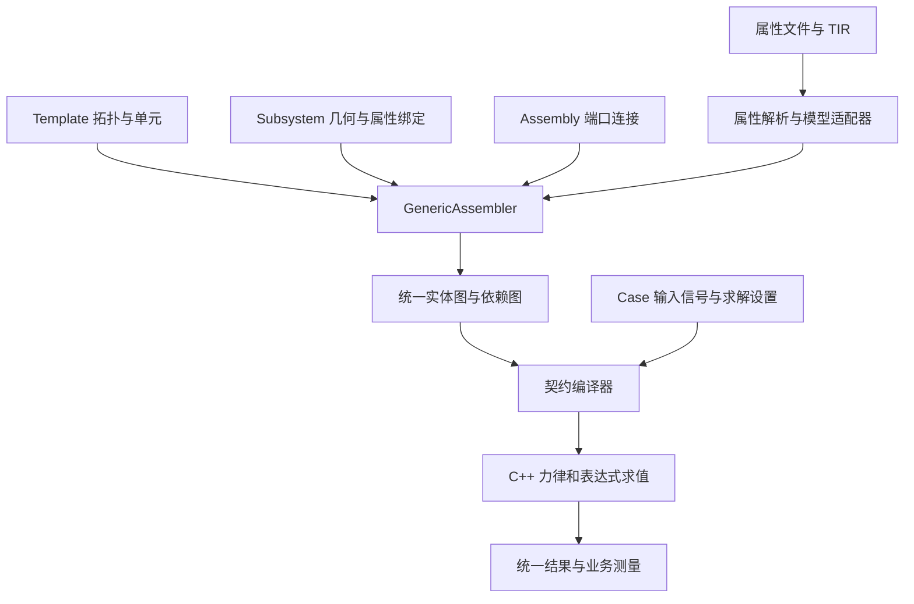

# 通用多体、轮胎单元与函数力元完整演进方案

状态：已实施并通过删除后快速门、数值门及完整回归，2026-10-06。最终多体回归 2034 passed / 1 既有 xfailed，kernel/contracts 127 passed；数值冻结、族路由和性能证据以 taskmaster raw 记录为准。动态自收敛/Adams 参考准确度的既有 FAILED/BLOCKED 诊断未被重录或隐藏。

目标：所有子系统和试验台的数据通过同一个通用装配器生成物理模型；轮胎作为复合建模单元，制动和驱动作为通用函数力元。七个业务构建模块在行为、调用与结果全部迁移后退役。Python 负责作者层与编译，C++ 负责运行时力计算。

## 1. 已核实的 Adams 依据

本机安装目录：`G:/MSC.Software/Adams/2025_1_1`。

| 事实 | 安装包证据 |
|---|---|
| wheel-tire 单元同时声明质量、惯量、轮心偏置与 `.tir` 引用 | `acar/shared_car_database.cdb/subsystems.tbl/TR_Front_Tires.sub:19` |
| tire 模板包含 wheel/mount part 及固定连接，接触力转换到轮心 | `help/adams_car/tire_syst.html:103` |
| tire 的求解表示主要为施加到 wheel 的 GFORCE | `help/adams_tire/How_to_Use_Adams_Tire.html:77` |
| 输入 rim+tire 总惯性，再校正轮胎模型内部已经计入的质量、惯量 | `help/adams_tire/wheel_inertia.html:55` |
| 力元声明 action、reaction、reference marker | `help/adams_view/dialogboxes/gfovfovto_modify2.html:128` |
| 运行时函数使用时间、位移、速度等当前状态 | `help/adams_view_fn/viewfn_runtime.3.002.html:58` |
| 台架通过 `VARVAL` 驱动力元，样条驱动变量 | `acar/examples/driver_testrig/__mdi_driver_testrig.cmd:1173`、`:1201` |
| 动力总成实例引用 engine map、differential、torque converter 属性曲线 | `acar/examples/vehicles/achassis_gs.vdb/subsystems.tbl/acar_gs_powertrain.sub:150` |
| 力与状态函数要求连续；位移型运动要求二次可微 | `help/adams_solver/Guidelines.html:148` |

共享数据库中的部分 `.tpl` 是二进制模板。上表使用已核实的帮助文档、ASCII `.sub` 和 `.cmd`，不把未解码模板中的具体公式当成事实。

## 2. 当前缺口与最终范围

当前 `authoring/generic.py` 已支持基础刚体图、关节、tire 复合单元、函数力元、镜像、模式、端口与原生求解；运行时公式由版本化程序和 C++ scalar/Dual 求值器执行，七类业务构建器已退役。

| 本方案完成时必须交付 | 独立后续能力，本轮不伪装成已覆盖 |
|---|---|
| tire 单元及当前内核实际支持的轮胎模型、`.tir` 导入 | FTire/CDTire DLL 集成、柔性轮辋、belt dynamics、完整 Adams TIR 兼容 |
| 单分量力/力矩及六分量 wrench 的运行时表达式 | 任意 Python 回调、任意动态加载用户插件 |
| 当前时间、参数、输入信号、marker 位姿/相对速度、曲线/曲面 | 任意隐式代数环、通用控制器状态方程、热状态模型 |
| 当前七类业务的拓扑、力元、K/C、道路与结果迁移 | 重写已验证轮胎力律或求解算法 |
| 现有 family/case 路由和结果兼容，普通数据台架 | 为通用化重命名全部协议和公开产品 |

当前已有的原生轮胎状态及 ABS 等固定模型继续保留。复杂有状态模型按明确原生模型选择；不在表达式内部偷偷修改状态。

实施前必须核对 schema、Python adapter、C++ reader 三者的真实能力交集。例如现有 schema 的 `vertical_linear` 和 `wheel_torque` 枚举不能单独作为原生支持证据。没有对应 reader/求解测试的类型必须补齐或在提交前拒绝。

## 3. 目标结构与职责



| 对象 | 唯一职责 |
|---|---|
| Template | 拓扑、建模单元、槽位、marker、端口、模式和函数声明 |
| Subsystem | 一次实例的硬点、惯性参数、属性与资源绑定 |
| Assembly | 子系统实例与端口连接；汽车总成规则可作独立校验 |
| Case | 时间、输入信号、扫描/载荷与求解设置 |
| Property | 参数、单位、曲线、模型类型、版本与来源 |
| GenericAssembler | 解析实例与引用、标准镜像、单元展开和连接；不按业务角色构建 |
| Model adapter | 按 primitive/model/version 校验和编译属性 |
| C++ model | 在当前构型和状态下计算力、导数及内部状态 |

同一物理事实只有一个权威来源：几何归实例、参数归属性、输入归工况、状态归运行实例。`suspension/brake/wheel` 等角色可保留用于分类和总成规则，不决定构建算法。

## 4. 统一数据契约

延续现有 TemplateDocument/SubsystemDocument/AssemblyDocument；增加字段而不另建一套对象入口。文件和内存对象通过相同编译过程，运行仍走 `simulate()` 与唯一原生提交入口。

| 模板声明 | 内容 |
|---|---|
| `bodies` | 通用刚体 |
| `hardpoints` | 实例提供的几何坐标 |
| `markers` | owner、局部位置/硬点引用、姿态或轴构造 |
| `joints` | 两端 marker、类型、模式、必要参考状态 |
| `elements` | 弹簧、阻尼、衬套及通用函数力元 |
| `symmetry` / `modes` | `mirrored_xz`、`asymmetric` 及 K/C 激活规则 |
| `joints[].axis_reference` / 旧 `axis_reference_role` | 由命名 marker/hardpoint 派生关节轴，不在业务代码推算 |
| `tires` | tire 复合单元定义；生成自有轮体和原生 tire 项 |
| `ports` | 几何接口、带单位的信号接口、道路接口 |
| `variables` | 无状态代数变量及其表达式 |
| `property_slots` | 参数与曲线的可替换绑定 |
| `outputs` | 原生结果引用和显式测量定义 |

所有引用限定到实例命名空间；展开后的实体记录原始模板、单元、属性和实例来源。实体名称唯一，外部连接通过端口，不通过 `chassis/rack/wheel` 名字猜测。

采用 additive schema 演进，旧数据含义不变。表达式程序自带版本，并由内核 capability 声明支持；旧内核遇到新特性明确拒绝。若无法保持既有字段语义，则显式升级契约版本，不能以新增开放 `parameters` 字段绕过版本管理。

## 5. Marker、Frame 与端口

marker 是固连于某刚体的完整坐标系，不只是一个点；port 是对外暴露的接口，可以引用 marker。

- marker 存 body-local SE3；由世界硬点生成时仅在编译边界完成坐标变换。
- 惯量明确为关于质心、以声明局部坐标轴表达的张量；不能把关于参考原点的惯量直接当质心惯量。
- 惯量积允许为负。现有 tire schema 的逐元素非负限制须移除，并同步修正 Python 校验；按对称性、正定/允许的零惯性条件及主惯量物理条件校验完整张量。
- 轴是无单位方向，声明其参考 frame；力是极向量，转矩与角速度是轴向量。
- 镜像必须同时转换位置、姿态、惯量、方向、marker 和带方向的测量引用；公式参数不做全局自动取负。输出标量的符号由声明的轴与测量定义确定。
- 几何端口连接生成显式关节或衬套；信号端口连接绑定变量；道路端口绑定已声明 road 资源。
- 固定连接保留各体质量；禁止仅因端口重合自动合并实体。必要的固定体凝聚放在独立编译优化中，以质量/惯量守恒验证。
- 单体外载也要显式声明 ground 反作用端，避免遗漏物理边界。

装配时验证端口类型、单位、标签、能力、数量及所生成连接。可选接口缺失只移除数据明确绑定的分支和输出。

## 6. Tire 复合建模单元

一个 tire 单元拥有一个轮体定义、轮胎模型绑定、机械安装 marker、旋转 marker、接触参考 marker、道路引用及输出。它在作者层是一个可复用单元，在求解层展开为通用实体。接触参考 marker 与旋转轮体 marker 可以相同，也可以明确指向不随轮胎自转的承载体 frame；两者不得由名称猜测。

以下是拟定结构，marker 和端口均须在模板中声明：

```json
{
  "tires": [{
    "name": "tire",
    "body": {
      "name": "wheel",
      "mass_slot": "wheel_mass",
      "inertia_slot": "wheel_inertia",
      "center_marker": "wheel_center"
    },
    "model_slot": "tire_model",
    "mount_port": "hub_mount",
    "spin_marker": "spin_axis",
    "contact_frame": {"port": "upright_frame"},
    "road_port": "road"
  }]
}
```

实例把 `tire_model` 绑定到 `.tir` 文件或已解析的同等内存属性。tire 生成的轮体不能在 `bodies` 再声明一份；重复 owner 定义报错。已有显式轮体的数据可在兼容转换阶段归一化到该单元。

安装拓扑必须独立明确：固定到已自转的 spindle，或通过 revolute 与 upright 相连，由模板/装配声明决定。tire 单元不自动补旋转副。`contact_frame` 明确引用本实例 marker 或已绑定几何端口，不直接跨实例猜测刚体名。它必须编译到原生 `tire_frame_body`、接触中心和方向字段；缺少接触 frame、或其与轮体/承载体关系无法证明时拒绝编译，不能默认复用 `spin_marker`。原生 reader 若缺少表达局部 frame 旋转的能力，须在 P2 补齐或明确拒绝该输入，不丢弃姿态。

### 6.1 TIR 解析

- 将已有 `.tir` 解析和垂向曲线读取从巨型 Adams 导入模块提取到属性层；Adams 导入和通用入口复用同一解析器，避免 authoring 反向依赖 Adams 业务导入。
- 解析模型标识、单位、尺寸、系数、曲线和明确的内部质量信息；保留文件内容哈希与消费记录。
- 以当前原生支持矩阵为准。影响力学的未支持模型/选项拒绝，不静默降级成另一种轮胎。
- 属性在编译前解析；运行期不从 C++ 打开 `.tir` 路径。内存与文件属性形成相同原生契约。
- `.tir` 换文件仅改变属性指纹；拓扑指纹是否变化由其是否产生内部实体决定。

### 6.2 唯一质量账

新作者层声明 rim+tire 总惯性。若制动盘单独建刚体，则总量不再包含它；简化凝聚模型可以包含它，但必须保持唯一归属。兼容转换先记录旧轮体和 tire 的独立惯性源，按声明的质心与局部轴核算总空间惯性，不能把旧轮体值直接解释成总量再重复加 tire 值。

当前不含内部惯性的刚性模型：全部惯性归轮体，tire 自有惯性字段为零。将来模型确实拥有内部惯性时，adapter 必须报告其质量、质心和完整张量，然后通过空间惯性搬运扣除，剩余轮体惯性要合法。

现有内核会把 tire 顶层质量/惯量加到承载体，而非自动扣除；并要求非零 tire mass 的中心在 body 原点。因此迁移不能同时发射总轮体惯性和非零 tire 惯性。旧数据中的非零 tire 惯性，只在总质量、质心、空间惯量及冻结输出均相同的条件下合入轮体并将 tire 顶层字段清零；否则由显式兼容声明保留原有独立惯性源和原生装配顺序。无法无损表达的数据拒绝，不猜测惯性归属。本轮不扩大内核的偏心质量能力。

### 6.3 道路与输出

首轮保持一个已声明的解析道路资源，各 tire 显式绑定它；已有逐 tire 的路面时间历程继续保留。不同 tire 绑定不同解析 road 是独立扩展，当前内核单一 `road_profile` 不得伪装成多道路。

保留轮心位姿、接触点、力矩、载荷、滑移、内部状态与诊断。方向统一按 wheel/tire marker 表达，不能依靠左右轮名字修正符号。

## 7. 通用函数力元

作者层提供三类：单轴平移力 `force`、单轴力矩 `torque`、六分量 `wrench`。弹簧、阻尼和六轴衬套继续使用已验证的原生模型，不必为了形式统一先改写为表达式。

| 字段 | 语义 |
|---|---|
| `action` | 受力刚体上的 marker |
| `reaction` | 反作用 marker，包括显式 ground |
| `reference` | 分量/方向所在坐标系 |
| `axis` | 单分量的局部方向 |
| `function` | 标量表达式或六分量表达式 |
| `bindings` | 参数、输入、测量、曲线的类型化引用 |
| `modes` | 数据决定该力元的激活模式 |
| `outputs` | 力、力矩、功率与必要诊断 |

标量有符号值决定 action 端施力方向；不能统一取 `abs()`。reaction 按同一世界 wrench 的反作用与作用点搬运计算：世界坐标下若 action 点为 a、reaction 点为 b，则 `F_b = -F_a`，`M_b = -M_a - (a-b) × F_a`。六分量力元在不同 marker 原点间要正确变换力矩；不能只给两端各贴 `F/-F` 而漏掉力臂项。纯力矩与两点共线力为简化情形。

当前原生 `rotational_torque` 是既有阻力/需求模型，其意义保持不变；新增通用 `torque` 表达式单元不能借用并改变旧类型的物理含义。

下面是新简化制动模板的拟定声明示例，绑定的参数、测量和信号各有单位：

```json
{
  "name": "brake_torque",
  "type": "torque",
  "action": "rotor_marker",
  "reaction": "caliper_marker",
  "reference": "rotor_marker",
  "axis": [0, 0, 1],
  "function": "-pressure * effective_area * mu * radius * tanh(spin / smoothing_speed)",
  "bindings": {
    "pressure": {"signal_port": "brake_pressure", "unit": "Pa"},
    "effective_area": {"property_slot": "effective_area", "unit": "m^2"},
    "mu": {"property_slot": "friction_coefficient", "unit": "1"},
    "radius": {"property_slot": "effective_radius", "unit": "m"},
    "spin": {"measurement": "relative_spin", "unit": "rad/s"},
    "smoothing_speed": {"property_slot": "smoothing_speed", "unit": "rad/s"}
  }
}
```

`relative_spin` 是模板另行声明的相对角速度测量，引用两端 marker 及旋转轴；公式无需识别轮胎、制动器或车辆角色。

## 8. 函数语言与变量

Python 解析为受限 AST，校验后编译成版本化指令/节点表；C++ 仅解释编译结果，编译时把名称绑定成整数索引。使用现有标准库和内核基础能力，不引入新依赖或跨语言逐次回调。

| 首轮必须支持 | 约束 |
|---|---|
| 算术、幂、sin/cos/tanh/exp 等常用数学函数 | 固定操作集合与参数数量 |
| `time`、属性参数、输入通道 | 单位明确；输入在当前内部求解时刻插值 |
| marker 位置、相对位移/速度、相对角速度 | 全部包含参考 frame，不暴露固定轮位数组下标 |
| 代数变量 | 明确依赖 DAG；循环在编译前拒绝 |
| 平滑阶跃、1D 曲线/2D 曲面 | 插值、导数、外推策略显式；使用已有数值工具 |
| 标量力、标量力矩或六分量输出 | force 为 N，torque 为 N·m，wrench 前三分量为 N、后三分量为 N·m |

时间用 s、长度用 m、力用 N、力矩用 N·m，输入单位在边界转换到 SI。角度除数、触发阈值和表轴也要校验单位。维度错误、未知引用、曲线越界按指定策略报告。

数据可存公式文本，原生契约携带 AST/程序与版本，不携带可执行 Python。每次 force evaluation 是纯计算；相同状态与输入得到相同值。表达式中的变量不能暗中积分。

求值顺序：当前 trial state 与时间 → 输入信号 → 几何/速度测量 → 代数变量 → 力元。首轮不允许通过本步力输出构造隐式代数环；反馈可依赖当前运动状态。需要内部微分状态的模型仍使用已有原生模型，通用状态方程另行扩展。

非平滑操作的光滑性必须声明。标量与方向导数路径同时支持；无法使用解析方向导数的表达式应走内核已存在的受控数值导数回退或明确拒绝，不能把其导数默认为零。

## 9. 制动和驱动的数据表达

制动单元是参数、测量、信号端口与 `torque` 力元的模板组合，简化模型无需自有刚体。详细模板可增加 rotor/caliper，力元绑定保持相同概念。

新建物理模型可采用：

```text
pressure = pressure_map(brake_input)
Tbrake = -pressure * effective_area * mu * effective_radius
         * tanh(relative_spin / smoothing_speed)
```

`effective_area` 包含明确的摩擦面计数；上述是连续动态摩擦，不声称实现零速静摩擦锁止。驻车模型需单独的已支持静摩擦模型。

驱动单元可采用：

```text
Tdrive = engine_map(engine_speed, throttle) * ratio * efficiency * share
```

`share` 是该实例的数据，数量不写死为四轮。复杂 shaft/differential 可通过刚体、约束与力元拓扑表达；对当前简化模型只迁移现有分配，不额外实现新差速器。

**迁移公式必须保持旧行为。** 不能借重构把旧 `DEMAND_SCALE`、限幅、符号正则化或乘法顺序改成上述新模型。为旧数据生成明确的兼容模板和属性，保留既有原生 `rotational_torque`/输入行为；新公式模型由用户选择。

压力生成/制动比例、传动比例与控制信号归模板及实例，不归通用装配器。旧输入归一化范围校验继续保留，并把输入通道从 tire index 改为稳定的声明引用；兼容转换保留原映射。

## 10. 原生实现必须闭环

表达式程序与通用力元直接归 native `Model`，由契约读取器初始化。利用现有文档入口，不要求为每条表达式扩展冻结 POD 参数槽；如果确实修改跨边界结构或内部布局版本，则更新单一 ABI 真源和镜像，不能无版本绕过。

- 标量总线：接入 `external_force_vector`，覆盖动态主残差、内部残差、静态残差与输出采样，明确 `brush_only/dynamics_only` 下的唯一计数。
- 导数总线：接入 `external_force_directional`/`assemble_directional_elements`；同一表达式程序同时评价普通标量与 Dual/方向导数。
- 施力使用现有 `add_force_on_body/add_torque_on_body`，确保 fixed/free body、局部坐标及 wrench sink 一致。
- residual/输出采样不得修改 model 或已接受状态，避免重复求值改变结果。
- 函数力元记录实际机械功率；制动耗散和驱动输入功率分别核算。普通任意公式不能自动声明一个不存在的保守势能。
- 输出注册元素数、身份、局部/世界 wrench、功率与诊断；旧结果字段继续存在，新数据按稳定实体 ID 读取。
- 表达式若后来增加内部状态，必须进入 solver 的未知量/候选状态与 accepted-step 提交机制，包含拒步回滚；不允许隐藏在求值器缓存中。

## 11. 通用装配和仿真入口收口

`GenericAssembler` 的固定流程：读取声明 → 解析属性/资源 → 展开镜像和 tire 单元 → 创建实体/marker → 匹配端口并生成物理连接 → 解析信号/变量依赖 → 校验质量与引用 → 编译原生文档。

类型适配器按 body/joint/bushing/tire/function-force 等物理单元注册；不按 suspension/steering/brake 等角色注册。对称性、模式和端口连接对每种模板使用同一机制。

现有七类预设输出普通 TemplateDocument，不再选择专用 build 函数。汽车总成完整性规则与业务测量仍有明确模块归属，可以保留角色分类；它们不创建实体，也不修改力律。

`simulate()` 对文件、内存文档和带台架文档归一化到同一实体图与结果 envelope。当前 generic 返回的底层 SubmittedRun 与业务 SimulationRun 差异需收口，保留 `run.raw` 以及原来可用的业务结果。

现有 `family` 键保留兼容。在最终迁移阶段，对当前全部已注册 preparation/family 验证同一原生实体图可进入动态、K/C、整车、handling、ride 和 comparison 流程；不得只迁移 slider 使用的两个 family 就删除七模块。

## 12. 七模块及台架迁移责任

| 旧模块/概念 | 迁移内容 | 最终归属 |
|---|---|---|
| suspension | 几何、轴参考、双侧展开、K/C 约束/衬套列、弹簧/阻尼/限位 | 模板数据 + 通用几何/模式解释 |
| steering | rack/tie rod/guide 拓扑、输入、无转向可选分支 | 模板数据 + 信号/端口 |
| wheel | 轮体、轮胎、质量归属、安装和凝聚 | tire 单元 + 原生 tire adapter |
| chassis | fixed/free、惯性参数、安装与质量真源 | body 声明 + 属性 |
| brake | 参数、需求映射、转矩、旋转反力 | 函数力元/兼容原生模型 + 模板 |
| drive | 转矩图谱、方向、比例、输入和反力 | 函数力元/兼容原生模型 + 模板 |
| anti_roll_bar | 现有拓扑和轮端简化力律/扭转力律的区别 | 各自显式模板和原生模型；不互相替换 |
| RigSpec/bench | 支撑、轮体、运动、输入输出与可选分支 | 普通模板；study/case 路由归运行声明 |
| capabilities | 可驱动坐标、kernel axis 映射 | `modeling.coordinates` 的显式报告；旧角色转换只在 `presets.legacy` 兼容边界 |

台架分为现有的两种所有权：`wheel_supplying` 由台架创建轮体及 tire，`vehicle_loading` 由车辆创建、台架只施加输入。迁移后两者都使用普通模板，端口验证保证轮体和 tire 只有一个创建者。可选驱动按声明裁剪并同步处理耦合项；必需驱动缺失或现有全量裁剪拒绝条件成立时明确报错，保留坐标到 kernel 轴组的 `axis_map` 语义。

旧声明转换器只翻译数据；它不得成为改名后的七套实体构建器。所有刚体、关节和力元最终由同一解释器实例化。

## 13. 实施顺序和每阶段退出条件

| 阶段 | 主要交付 | 必须达到的退出条件 |
|---|---|---|
| P0 能力与基线清单 | 类型支持矩阵、旧调用/职责清单、物理与结果基线 | schema/adapter/native reader 一致；明确每个旧业务的等价标准 |
| P1 坐标系与接口 | marker、三类端口、惯性和方向规则 | 非悬架模型、旋转 frame、镜像、合法负惯量积、引用/单位错误路径通过 |
| P2 tire 闭环 | TIR 共用解析器、复合单元、唯一质量账、road/output | 单轮加载/滚动、双侧接触 frame、TIR 切换、旧非零 tire 惯性迁移、文件/内存等价；总质量/质心/空间惯量及冻结数值不变 |
| P3 函数程序 | AST/单位/依赖校验、信号、标量/Dual 原生求值 | 时间与状态公式、曲线导数、Jacobian 对照、循环/非法类型拒绝通过 |
| P4 通用函数力元 | force/torque/wrench、结果和功率 | 有符号驱动转子、制动耗散、两体反力、六分量力臂、静态/动态收敛通过 |
| P5 业务与台架迁移 | 七类数据预设、旧声明翻译、所有 family/结果消费者迁移 | 全量生产调用走通用解释器；两类台架无重复轮体/tire；驱动裁剪、耦合项、全量裁剪拒绝与 axis_map 等价；既有数值/性能/输出兼容 |
| P6 退役收尾 | 清除 builder 注册、导入/导出、七模块和失效适配 | 生产代码和公开导出零引用（退役门负例测试除外）；退役 AST 门有正反例；完整验收通过 |

每阶段先验证再进入下一阶段。不在 P1/P2 开始删除业务模块。P3/P4 的内核扩展必须先完成导数和结果闭环，再以制动/驱动示例证明能力。

## 14. 文件与模块改动范围

| 范围 | 责任 |
|---|---|
| `suspension_contracts/.../template/subsystem/assembly/multibody_model/multibody_case` | marker/tire/function/signal 数据契约、程序版本和校验 |
| `authoring/documents.py`、`properties.py`、属性层 TIR 模块 | 数据解析、资源解析、实例参数和哈希 |
| `authoring/generic.py` | 统一装配、物理单元 adapter、端口和程序编译接入 |
| `modeling/ports.py`、marker/spatial 类型 | 完整 frame、signal/road 接口 |
| `presets/`、`templates/` | 七类模板数据；保留角色分类，清除业务 builder 选择 |
| `subsystems/si_assembly.py`、`element_build.py`、`torque_elements.py` | 调用迁移及最终退役 |
| `rigs/`、`preparation/`、`cases/`、`api.py`、结果层 | 普通数据台架、全 family 接入和结果兼容 |
| `kernel/.../contract_model.cpp`、native Model、程序模块 | 新契约读取与表达式程序 |
| `kernel/.../element/`、`force/` | 标量/方向导数施力、功率、输出 |
| `kernel/.../output/`、构建/capability 文件 | 结果布局、能力声明及构建镜像 |
| 各包现有测试与 architecture 门 | 单元、集成、数值、性能与退役保护 |

目录是职责范围，实施按现有分层落点确定；不先引入新的通用框架或依赖。测试与构建不能和另一个写入者并发修改同一工作区。

## 15. 验收矩阵

| 类别 | 关键验收 |
|---|---|
| 几何/惯性 | world/local 转换、镜像轴与姿态、惯量单位平方、COM、总质量与空间惯量守恒 |
| Tire | 当前支持 TIR 对标、旧独立惯性源无损迁移、质量无重复、明确 road、双侧接触 frame/方向、不同实例内部状态独立、unsupported model 拒绝 |
| 函数 | 参数/信号/测量引用、SI 维度、DAG、曲线内外插、程序版本、错误实体定位 |
| 力元 | 作用反作用与全局力矩、驱动力矩保留正负、制动功率非正、wrench 力臂转换 |
| 求解 | 状态依赖力的静态平衡；动态反馈；Dual 与有限差分 Jacobian 对照；Newton trial 不污染已接受状态 |
| 结果 | wrench/功率/诊断身份稳定，采样重复求值不改变状态；旧业务测量保持 |
| 兼容 | 每个七类预设/已注册 family、无转向/无制动/无驱动组合；两类台架所有权、驱动及耦合裁剪、全量裁剪拒绝和 axis_map；文件/内存同一结果 |
| 退役 | 生产代码和公开导出零引用（退役门负例测试除外）；禁止七个 build 模块重新成为实体生产者 |

每阶段执行仓库 `check-fast`（Windows 缺 sh 时按 AGENTS 展开命令），触及求解路径执行 `gate-numeric`；轮胎力律/对标相关运行 `adams/`，cases/preparation 相关运行 `cases/`；跨子系统收尾执行 architecture pytest 与完整回归、`git diff --check`。

不重录冻结物理/性能基线，不增加 skip/xfail，不弱化断言。最终成功必须包括已有冻结输出一致、原生非悬架 tire/函数力元示例成功、所有旧入口行为兼容，以及生产代码和公开导出对七业务构建模块零引用（退役门负例测试除外）。

性能分开检查：无表达式旧模型保持既有路径与预算；表达式模型用明确数量和状态依赖程度测量求值/Jacobian成本，不把 Python 回调放入力评价循环。

## 16. 删除条件与最终交付

七模块只有在 P5 验收完成后才删除。当前删除条件已满足：职责逐项迁完，生产代码和公开导出零引用（退役门负例测试除外），两类台架所有权、驱动裁剪及轴映射通过验收，结构门捕获重新引入的旧引用，旧模型数值/性能/输出兼容，通用 tire 与函数力元已真实求解。七个业务模块及旧能力扫描文件已从 `subsystems/` 删除。

最终交付包括：一套作者层声明与统一解释器、tire 复合单元及 TIR 适配、可在内核实时求值的 force/torque/wrench、七类纯数据预设与普通台架、统一仿真/结果入口，以及可复查的回归与退役证据。可运行文件示例在 `examples/generic_multibody/verify.py`，覆盖单轮静态载荷、TIR 文件绑定和带当前角速度反馈的有符号转矩。

## 17. 已实现接口速查

- `GenericSubsystemAssembler` 解释通用声明并编译原生实体；旧工程单位数据经 `presets.legacy` 转译，保留结果消费者所需的 Python 物理对象。两条路径共享刚体工厂，兼容理想关节使用同一通用关节工厂，全部原生声明由同一 C++ reader 和求解路径消费。
- `TemplateDocument` 的 `symmetry`、`modes`、`axis_reference`、`ports`、`tires`、`elements` 经过同一文件/内存编译路径进入 native model；元素公式编译为 native `function_programs`。
- `modeling.coordinates.AssemblyCapabilities` 只接受贡献声明的 `drive_coordinates`；`presets.legacy.capabilities_for` 是旧 role-only 调用的翻译边界，不参与通用实体创建。
- 单轴 wheel-supplying 台架通过 `wheel_centre` 端口生成显式固定连接；整车 vehicle-loading 台架只消费车辆声明的 wheel/road 输入。通用文档路径按端口绑定；旧工程单位兼容装配仍保留既有轮端标签和左右后缀翻译，能力报告不再探测刚体名称。
- 退役保护位于 `tests/architecture/test_generic_builder_retirement.py` 和 `legacy_surface_gate.py`，覆盖静态、相对、别名、动态和常量导入，以及旧文件复活。
